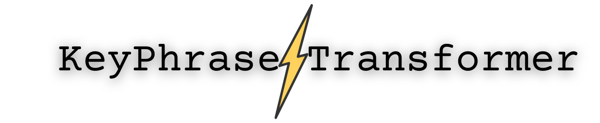

<p align="center">
<b>Quickly extract key-phrases/topics from you text data with T5 transformer
</b>


**KeyPhraseTransformer** is built on T5 Transformer architecture, trained on 500,000 training samples to extract important phrases/topics/themes from text of any length.

### Why KeyPhraseTransformer?
 - It needs no preprocessing of your data. Just dump you data to KeyPhraseTransformer
 - No need to choose one word, two word or 3 word length phrases to extract. It has been trained to extract phrases which are important, regardless of number of words.
 - It processes text of any length (It breaks you text data into chunks internally)


```python
from keyphrasetransformer import KeyPhraseTransformer

kp = KeyPhraseTransformer()

doc = """
Transfer learning, where a model is first pre-trained on a data-rich task before being fine-tuned 
on a downstream task, has emerged as a powerful technique in natural language processing (NLP). 
The effectiveness of transfer learning has given rise to a diversity of approaches, methodology, and practice. 
In this paper, we explore the landscape of transfer learning techniques for NLP by introducing a unified framework 
that converts every language problem into a text-to-text format. Our systematic study compares pretraining objectives, 
architectures, unlabeled datasets, transfer approaches, and other factors on dozens of language understanding tasks. 
By combining the insights from our exploration with scale and our new “Colossal Clean Crawled Corpus”, 
we achieve state-of-the-art results on many benchmarks covering summarization, question answering, 
text classification, and more. To facilitate future work on transfer learning for NLP, 
we release our dataset, pre-trained models, and code.

"""

kp.get_key_phrases(doc)
```
```
['transfer learning',
 'natural language processing (nlp)',
 'nlp',
 'text-to-text',
 'language understanding',
 'transfer approach',
 'pretraining objectives',
 'corpus',
 'summarization',
 'question answering']
 ```